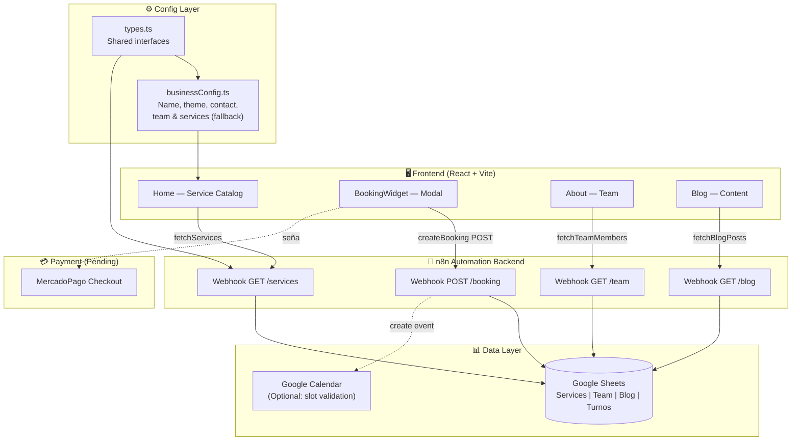
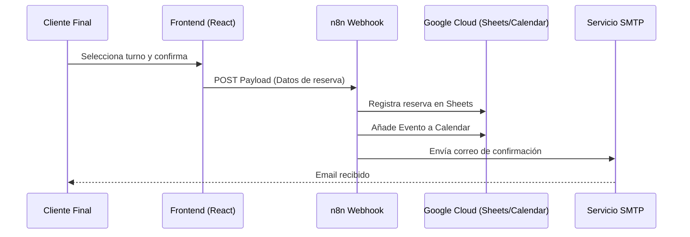

# AgendaPro — Booking SaaS Template

**English** | [Español](#español)

I'm Sergio Callier, Electronics & Telecommunications Engineer (UTN, Argentina). I build automation systems and AI-powered tools for real business problems.

This repository is a production-ready frontend template for **appointment booking systems** targeting beauty, wellness, and service businesses. It connects to a n8n automation backend and uses Google Sheets as a zero-cost CMS/database.

---

## Architecture Overview



---

## What's here

| File / Folder | What it does |
|---|---|
| `src/pages/Home.tsx` | Service catalog with booking CTA, map section, success flow with WhatsApp deep-link |
| `src/pages/About.tsx` | Team section, dynamically loaded from n8n / fallback config |
| `src/pages/Blog.tsx` | Filterable article list, loaded from Google Sheets via n8n |
| `src/components/BookingWidget.tsx` | Full booking modal: professional selector, date carousel, time slots, personal data form, deposit summary |
| `src/layouts/MainLayout.tsx` | Navbar with glassmorphism, dark/light toggle, responsive mobile menu, KlierNav footer |
| `src/services/n8nService.ts` | HTTP client for all n8n webhooks, with mock fallback for offline dev |
| `src/services/calendarService.ts` | Slot availability fetcher (mock-ready, connects to Google Calendar via n8n) |
| `src/config/businessConfig.ts` | Single file to rebrand the entire app: name, logo, colors, contact, team, services |
| `src/types.ts` | Shared TypeScript interfaces (breaks circular dependency between services and config) |
| `n8n_get_data_workflow.json` | n8n workflow: GET webhooks for services, team, and blog from Google Sheets |
| `n8n_create_booking_workflow.json` | n8n workflow: POST booking → append to Google Sheets → (optional) Google Calendar event |
| `n8n_workflows_specs.md` | Technical spec for configuring n8n nodes and the Google Sheets column format |
| `src/database_schema.md` | Google Sheets structure required for the backend to work |

---

## Features

- **Zero-backend-cost**: Google Sheets as CMS + n8n as middleware. No database to pay for.
- **Instant rebrand**: change `businessConfig.ts` → new business, colors, team, services. One file.
- **Offline-safe**: all data fetchers have mock fallback — the app works without n8n connected.
- **Dark/light mode**: system-aware default with toggle, persisted to localStorage.
- **Glassmorphism UI**: premium feel with Tailwind custom palettes, Inter font, smooth animations.
- **WhatsApp deep-link**: after booking, generates a pre-filled WhatsApp message for the business to confirm.
- **Google Calendar link**: post-booking flow offers an "Add to Google Calendar" button.
- **Professional selector**: clients choose which team member to book with.

---

## Tech Stack

| Layer | Technology |
|---|---|
| Frontend | React 19 + TypeScript + Vite 7 |
| Styling | Tailwind CSS v3 + CSS custom properties |
| Routing | React Router v7 |
| Icons | Lucide React |
| Date handling | date-fns v4 |
| Automation backend | n8n (self-hosted or cloud) |
| Database | Google Sheets |
| Hosting (suggested) | Vercel / Netlify |

---

## Quick Start (Demo Mode)

```bash
git clone https://github.com/SerjCallier/agendapro-booking-template
cd agendapro-booking-template
npm install
npm run dev
```

## 🏗️ Integración n8n (Concepto)

*(Nota: Se debe contar previamente con todas las API y credenciales correspondientes configuradas en Google Cloud Platform).*

La aplicación está diseñada para enviar el payload de reserva a una URL de webhook. Una vez que la reserva se confirma en el Frontend, los datos viajan hacia un escenario en **n8n** que se encarga de:
1. Registrar la fila en Google Sheets.
2. Enviar el email de confirmación (vía SMTP/Gmail).
3. Añadir el evento a Google Calendar.

### Flujo de Arquitectura



---

*Desarrollado y mantenido por [KlierNav Innovations](https://www.kliernav.com.ar).*
