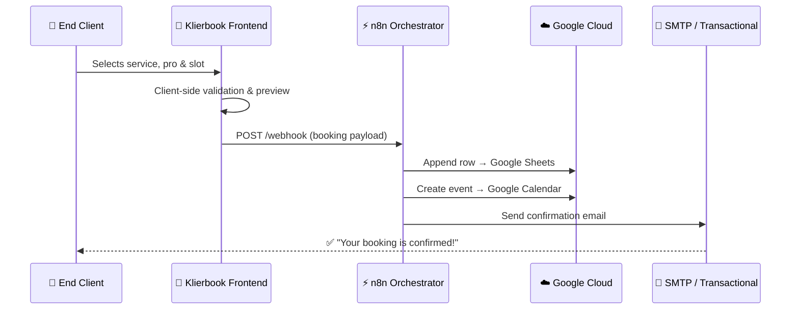

# 📅 Klierbook


> **Zero-subscription booking SaaS** that turns any professional service into a 24/7 self-scheduling machine — powered by n8n orchestration and Google Cloud.

---

## 💡 Why Klierbook?

Most booking tools lock small businesses into **$30–$80/month subscriptions** before they've even validated demand. Klierbook flips that model: a premium, white-label frontend that connects to a **free-tier n8n + Google Sheets backend**, giving businesses an enterprise-grade booking experience at **zero recurring cost** — with a clear upgrade path as they scale.

**Built for:** Spas, barbershops, dental clinics, personal trainers, consulting firms, and any service-based business that runs on appointments.

---

## ✨ Features

| Feature | Description |
| :--- | :--- |
| 🔄 **Frictionless Booking Flow** | Multi-step wizard: service → professional → date/time → confirmation. Zero page reloads. |
| 🎨 **Dynamic Theming Engine** | Swap between curated palettes per niche — dark mode for barbershops, warm tones for beauty salons, clinical whites for dentists. |
| 📱 **Mobile-First Conversion** | Every pixel optimized for thumb-friendly booking on smartphones. 60%+ of bookings happen on mobile. |
| 🔗 **n8n Webhook Integration** | On confirmation, the payload fires to an n8n workflow that handles Google Sheets logging, Calendar sync, and email/SMS notifications — all without a traditional backend. |
| 🌐 **i18n Ready** | Full bilingual support (EN/ES) with locale-aware date formatting out of the box. |

---

## 🏗️ Architecture



> **Key insight:** By using n8n as the orchestration layer, the entire backend is visual, auditable, and extensible — no server code to maintain.

---

## 🚀 Quick Start

```bash
# Clone the repository
git clone https://github.com/SerjCallier/klierbook.git
cd klierbook

# Install dependencies
npm install

# Start development server
npm run dev
```

Then open `http://localhost:5173` and configure your webhook URL in the environment variables.

---

## 🔮 Roadmap

- [ ] Stripe/MercadoPago payment integration at booking time
- [ ] SMS reminders via Twilio (n8n node)
- [ ] Multi-location support with independent calendars
- [ ] Admin dashboard for business owners

---

<p align="center">
  <i>Engineered by <a href="https://www.kliernav.com"><b>KlierNav Innovations</b></a> — AI-First Digital Agency</i>
</p>

---

<details>
<summary>🇦🇷 Versión en Español</summary>

## 📅 Klierbook

> **SaaS de reservas sin suscripción** que convierte cualquier servicio profesional en una máquina de auto-agendamiento 24/7 — orquestado por n8n y Google Cloud.

### 💡 ¿Por qué Klierbook?

La mayoría de herramientas de turnos cobran **$30–$80/mes** antes de que el negocio haya validado la demanda. Klierbook invierte el modelo: un frontend premium y white-label conectado a un **backend gratuito en n8n + Google Sheets**, dando una experiencia de reservas de nivel enterprise a **costo cero recurrente**.

**Ideal para:** Spas, barberías, consultorios odontológicos, entrenadores personales, estudios de consultoría.

### ✨ Características
| Feature | Descripción |
| :--- | :--- |
| 🔄 **Flujo sin Fricción** | Wizard multi-paso: servicio → profesional → fecha/hora → confirmación. Sin recargas de página. |
| 🎨 **Motor de Temas Dinámico** | Paletas curadas por nicho — modo oscuro para barberías, tonos cálidos para salones de belleza. |
| 📱 **Conversión Mobile-First** | Cada píxel optimizado para reservar con el pulgar. +60% de las reservas son desde celular. |
| 🔗 **Integración n8n** | Al confirmar, el payload dispara un flujo n8n que sincroniza Sheets, Calendar y envía notificaciones. |
| 🌐 **i18n Listo** | Soporte bilingüe completo (EN/ES) con formateo de fechas por locale. |

### 🛠️ Stack
- **Framework:** React 19 + TypeScript
- **Estilos:** Tailwind CSS
- **Orquestación:** n8n / Webhooks
- **Build:** Vite

</details>
