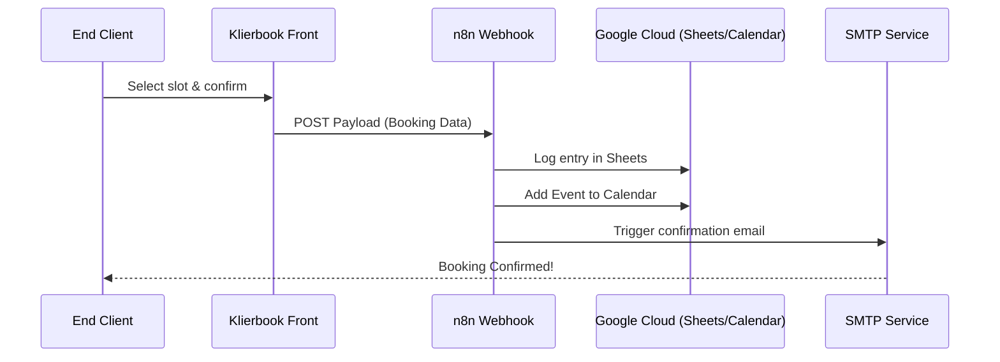

# 📅 AgendaPro Booking Template

Plantilla de Frontend para una aplicación SaaS de reservas y gestión de citas, diseñada para el sector de estética, barberías, consultorios y servicios profesionales.

Desarrollada bajo el ala de **KlierNav Innovations**, esta aplicación está pensada para integrarse fluidamente con un backend sin código vía **n8n** y **Google Sheets**, ofreciendo una solución de "suscripción cero" para negocios de entrada, con proyección de escalar hacia arquitecturas más robustas, previsibles y maduras junto al crecimiento del cliente.

---

## 🚀 Características Principales

- **Flujo de Reservas Intuitivo:** Selección de servicios, profesionales y fechas en pasos sin fricción.
- **Diseño Premium:** Interfaz de usuario pulida con Tailwind CSS, optimizada para conversión móvil.
- **Temetización Dinámica:** Paletas de colores adaptables a diferentes rubros (ej. Dark mode para barberías, colores cálidos para salones de uñas).
- **Integración Nocode:** Preparado para mandar datos directamente a webhooks de n8n para orquestar correos de confirmación y Google Sheets.

## 🛠️ Stack Tecnológico

- **Framework:** React 19 + TypeScript
- **Build Tool:** Vite
- **Estilos:** Tailwind CSS
- **Iconos:** Lucide React

## 📦 Uso Rápido (Desarrollo Local)

1. Clonar el repositorio:
   ```bash
   git clone https://github.com/SerjCallier/agendapro-booking-template.git
   ```
2. Instalar dependencias:
   ```bash
   npm install
   ```
3. Iniciar el servidor de desarrollo:
   ```bash
   npm run dev
   ```

## 🏗️ Integración n8n (Concepto)

*(Nota: Se debe contar previamente con todas las API y credenciales correspondientes configuradas en Google Cloud Platform).*

La aplicación está diseñada para enviar el payload de reserva a una URL de webhook. Una vez que la reserva se confirma en el Frontend, los datos viajan hacia un escenario en **n8n** que se encarga de:
1. Registrar la fila en Google Sheets.
2. Enviar el email de confirmación (vía SMTP/Gmail).
3. Añadir el evento a Google Calendar.

### Flujo de Arquitectura



---

## 🛠️ Stack

- **Framework:** React 19 + TypeScript
- **Styling:** Tailwind CSS
- **Orchestration:** n8n / Webhooks

---

*Engineered by [KlierNav Innovations](https://www.kliernav.com).*

---

<details>
<summary>🇦🇷 Versión en Español</summary>

## 📅 Klierbook

Plantilla Frontend premium para sistemas SaaS de reservas y gestión de citas. Diseñada para negocios de estética, barberías, consultorios y servicios profesionales.

Creada por **KlierNav Innovations**, integra a la perfección con **n8n** y **Google Sheets** para una solución de entrada sin suscripción que escala hacia arquitecturas empresariales.

### 🚀 Características Principales
- **Flujo de Reservas sin Fricción:** Selección intuitiva de servicios y profesionales.
- **UI de Alto Nivel:** Pulida con Tailwind CSS, optimizada para conversión móvil.
- **Tematización Dinámica:** Paletas adaptables por rubro (Dark/Luxury/Clean).
- **Nativo para n8n:** Dispara webhooks para confirmación automática y sincronización de calendario.

### 🛠️ Stack
- **Framework:** React 19 + TypeScript
- **Estilos:** Tailwind CSS
- **Orquestación:** n8n / Webhooks

</details>
