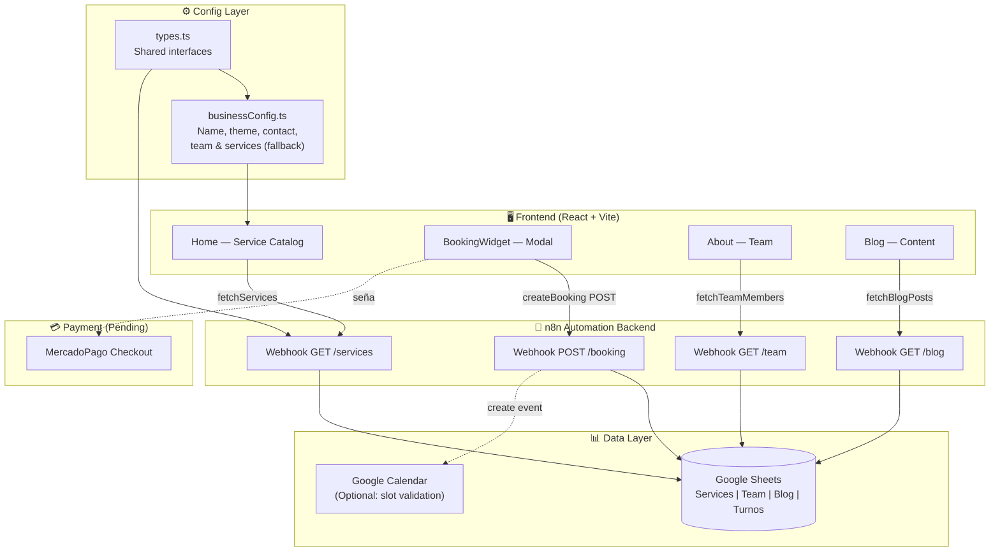

# AgendaPro — Booking SaaS Template

**English** | [Español](#español)

I'm Sergio Callier, Electronics & Telecommunications Engineer (UTN, Argentina). I build automation systems and AI-powered tools for real business problems.

This repository is a production-ready frontend template for **appointment booking systems** targeting beauty, wellness, and service businesses. It connects to a n8n automation backend and uses Google Sheets as a zero-cost CMS/database.

---

## Architecture Overview



---

## What's here

| File / Folder | What it does |
|---|---|
| `src/pages/Home.tsx` | Service catalog with booking CTA, map section, success flow with WhatsApp deep-link |
| `src/pages/About.tsx` | Team section, dynamically loaded from n8n / fallback config |
| `src/pages/Blog.tsx` | Filterable article list, loaded from Google Sheets via n8n |
| `src/components/BookingWidget.tsx` | Full booking modal: professional selector, date carousel, time slots, personal data form, deposit summary |
| `src/layouts/MainLayout.tsx` | Navbar with glassmorphism, dark/light toggle, responsive mobile menu, KlierNav footer |
| `src/services/n8nService.ts` | HTTP client for all n8n webhooks, with mock fallback for offline dev |
| `src/services/calendarService.ts` | Slot availability fetcher (mock-ready, connects to Google Calendar via n8n) |
| `src/config/businessConfig.ts` | Single file to rebrand the entire app: name, logo, colors, contact, team, services |
| `src/types.ts` | Shared TypeScript interfaces (breaks circular dependency between services and config) |
| `n8n_get_data_workflow.json` | n8n workflow: GET webhooks for services, team, and blog from Google Sheets |
| `n8n_create_booking_workflow.json` | n8n workflow: POST booking → append to Google Sheets → (optional) Google Calendar event |
| `n8n_workflows_specs.md` | Technical spec for configuring n8n nodes and the Google Sheets column format |
| `src/database_schema.md` | Google Sheets structure required for the backend to work |

---

## Features

- **Zero-backend-cost**: Google Sheets as CMS + n8n as middleware. No database to pay for.
- **Instant rebrand**: change `businessConfig.ts` → new business, colors, team, services. One file.
- **Offline-safe**: all data fetchers have mock fallback — the app works without n8n connected.
- **Dark/light mode**: system-aware default with toggle, persisted to localStorage.
- **Glassmorphism UI**: premium feel with Tailwind custom palettes, Inter font, smooth animations.
- **WhatsApp deep-link**: after booking, generates a pre-filled WhatsApp message for the business to confirm.
- **Google Calendar link**: post-booking flow offers an "Add to Google Calendar" button.
- **Professional selector**: clients choose which team member to book with.

---

## Tech Stack

| Layer | Technology |
|---|---|
| Frontend | React 19 + TypeScript + Vite 7 |
| Styling | Tailwind CSS v3 + CSS custom properties |
| Routing | React Router v7 |
| Icons | Lucide React |
| Date handling | date-fns v4 |
| Automation backend | n8n (self-hosted or cloud) |
| Database | Google Sheets |
| Hosting (suggested) | Vercel / Netlify |

---

## Quick Start (Demo Mode)

```bash
git clone https://github.com/SerjCallier/agendapro-booking-template
cd agendapro-booking-template
npm install
npm run dev
```

The app runs fully in demo mode with mock data — no backend required.

---

## Connecting the Backend

1. Import `n8n_get_data_workflow.json` and `n8n_create_booking_workflow.json` into your n8n instance
2. Create a Google Sheet following `src/database_schema.md`
3. Activate the webhooks in n8n (copy the Production URLs)
4. Fill in `.env` with your webhook URLs:

```env
VITE_N8N_SERVICES_URL=https://your-n8n.cloud/webhook/services
VITE_N8N_TEAM_URL=https://your-n8n.cloud/webhook/team
VITE_N8N_BLOG_URL=https://your-n8n.cloud/webhook/blog
VITE_N8N_BOOKING_URL=https://your-n8n.cloud/webhook/booking
```

---

## Rebranding (For Clients)

Edit a single file: `src/config/businessConfig.ts`

```ts
export const businessConfig = {
  name: "Tu Negocio",
  tagline: "Tu slogan aquí",
  theme: {
    primaryLight: "#c68d49",  // brand color light mode
    primaryDark:  "#d0a46d",  // brand color dark mode
  },
  contact: {
    phone: "+54 9 11 ...",
    whatsapp: "https://wa.me/549...",
    address: "Tu dirección",
  },
  // ... team, services, social
};
```

---

## Roadmap

- [ ] MercadoPago Checkout integration (deposit payment)
- [ ] Real-time slot validation via Google Calendar
- [ ] Admin panel (edit services/team without touching code)
- [ ] Email confirmation via n8n + Gmail node

---

## Background

This project is part of the **KlierNav** toolkit — a set of production-ready starters and automation templates I build for small and medium businesses in Argentina.

The goal is to give local businesses the kind of booking experience that usually costs thousands of dollars per month (Calendly, Acuity, etc.) with zero SaaS subscription fees.

---

<a name="español"></a>

## 🇦🇷 Español

Soy Sergio Callier, Ingeniero en Electrónica y Telecomunicaciones (UTN). Construyo sistemas de automatización y herramientas con IA para problemas concretos de negocio.

Este repositorio es un template de frontend listo para producción para **sistemas de reserva de turnos**, orientado a negocios de estética, bienestar y servicios. Se conecta a un backend de automatización en n8n y usa Google Sheets como CMS/base de datos de costo cero.

### Qué hay acá

- **`businessConfig.ts`** — archivo único para rebrandear toda la app: nombre, colores, equipo, servicios, contacto.
- **`BookingWidget`** — modal de reserva completo: selector de profesional, carrusel de fechas, slots de horario, formulario de datos personales.
- **Workflows n8n** — listos para importar. Conexión con Google Sheets para lectura de catálogo y escritura de reservas.
- **Modo demo** — la app funciona sin backend conectado gracias a datos mock de fallback.
- **WhatsApp deep-link** — post-reserva genera un mensaje pre-escrito para confirmar la seña por WhatsApp.

### Contexto

Este proyecto es parte del toolkit **KlierNav** — un conjunto de starters y templates de automatización que construyo para pequeñas y medianas empresas en Argentina.

El objetivo: darle a los negocios locales la experiencia de booking que normalmente cuesta miles de dólares por mes (Calendly, Acuity, etc.) con cero subscripción a SaaS.

---

> Built by [Sergio Callier](https://github.com/SerjCallier) · Powered by **KlierNav**
